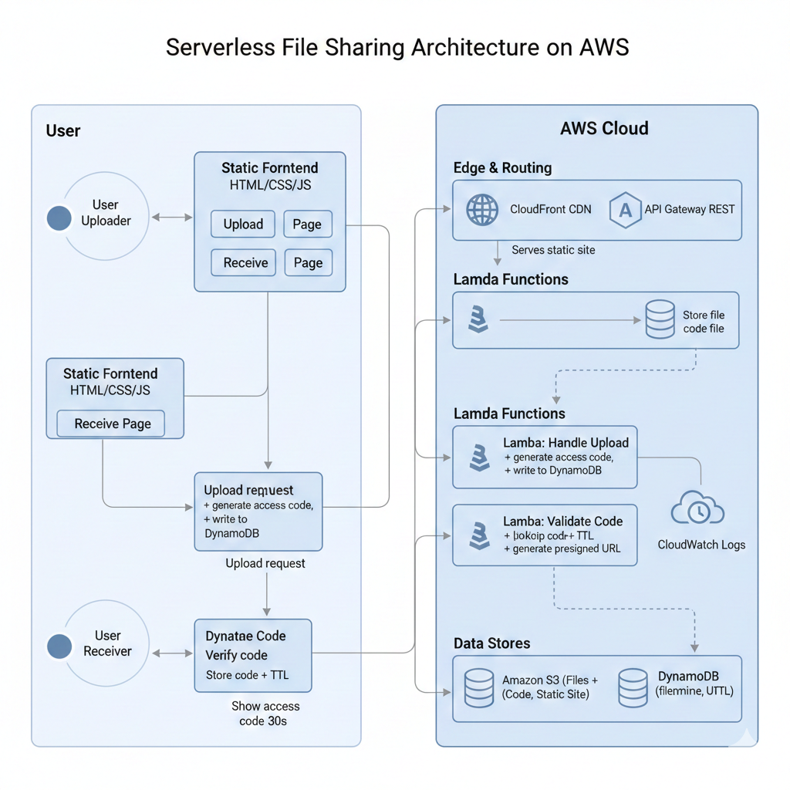

# CloudShare

CloudShare is a serverless, temporary file-sharing service built entirely on AWS. Users can upload a file, receive a short access code, and share it with someone else to download the file. Everything is automated, short-lived, and fully serverless.

## How It Works

1. **Upload**  
   The user selects a file and uploads it through the web interface.

2. **Code Generation**  
   A Lambda function generates a unique access code (e.g., `AB12CD34`) for the file.

3. **Temporary Storage in S3**  
   The uploaded file is stored in Amazon S3 with the correct metadata.  
   S3 is also used to host the frontend website.

4. **Tracking in DynamoDB**  
   DynamoDB stores:
   - the generated access code  
   - the original filename  
   - the MIME type  
   - a TTL timestamp for cleanup

5. **Code Display**  
   The frontend shows the generated code, and it automatically disappears after 30 seconds.

6. **Receiving**  
   The recipient enters the access code on the Receive page.

7. **Presigned URL Delivery**  
   A Lambda function validates the code and returns a presigned S3 download URL.  
   This URL is valid for **1 hour**.

8. **Download**  
   The user downloads the file using the presigned link, with the correct filename and MIME type preserved.

9. **Expiration & Cleanup**  
   Files stay available in the cloud for **24 hours**.  
   After that:
   - the S3 object is deleted  
   - the DynamoDB record expires  
   - the access code becomes invalid

## Architecture



## Project Structure

```
CloudShare/
├── .github/
│   └── workflows/
├── img/
│   └── logo.png
├── lambda/
│   ├── download_lambda.py
│   ├── feedback_lambda.py
│   └── upload_lambda.py
├── .gitignore
├── CloudShare(logo).png
├── index.html
├── README.md
├── script.js
├── style.css
└── Working.mp4
```

## Tech Stack

- **AWS Lambda** – Backend logic  
- **Amazon S3** – File storage + static website hosting  
- **Amazon DynamoDB** – Stores file metadata and feedback; file metadata is auto-expired using TTL  
- **API Gateway (REST)** – Acts as the interface between the frontend and Lambda  
- **CloudFront** – Provides HTTPS and global CDN caching for the static site  
- **IAM** – Roles for Lambda + a dedicated CI/CD IAM user used by GitHub Actions  
- **GitHub Actions** – CI/CD pipeline for deploying updates to AWS  
- **CloudWatch** – Logs and monitoring for Lambda functions  
- **Frontend** – Static HTML, CSS, and JavaScript

## Purpose

A minimal, serverless, no-account file-sharing tool designed for quick, temporary transfers with automatic cleanup.

## 🎥 YouTube Video

Check out the full walkthrough and demo of **CloudShare** on YouTube:

▶️ **Watch here:** https://youtu.be/NGL95asKHoM
